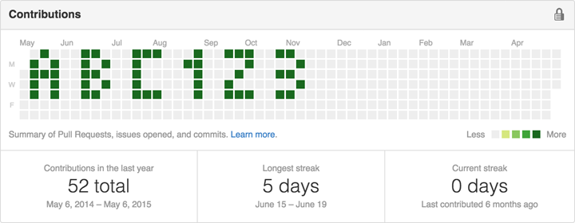
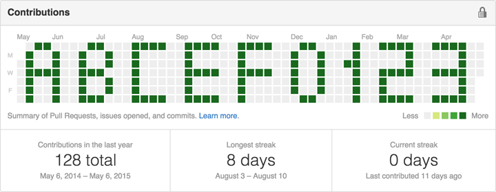

Github Art
==========

[](https://travis-ci.org/ufocoder/py-GithubArt)
[](https://pypi.python.org/pypi?name=github_art)
[](https://coveralls.io/r/ufocoder/py-GithubArt?branch=master)

Python project to write string on Contributions Github account table

Usage
-----


1. Clone project and move to project folder:

```
git clone https://github.com/ufocoder/py-GithubArt.git
cd py-GithubArt
```

2. Create folder to build git project, for example:
```
mkdir ~/build
```

3. Create github project

4. Run python github_art, there's an example of script usage:

```
python github_art \
    --string abc123 \
    --path ~/build \
    --username network-batman \
    --project gotham-city
```

Result Contributions table:



You could use other dictionary to write:

```
python github_art \
    --string abcef012345 \
    --dictionary alphanumeric2x \
    --path ~/build \
    --username network-batman \
    --project gotham-city
```

Result Contributions table:



There's [example](https://github.com/network-batman) of second github_art usage


Options
-------
* string - your string [required parameter]
* dictionary - alphanumeric or alphanumeric2x
* path - there's a path to your github project [required parameter]
* project - URL to your github project [required parameter]
